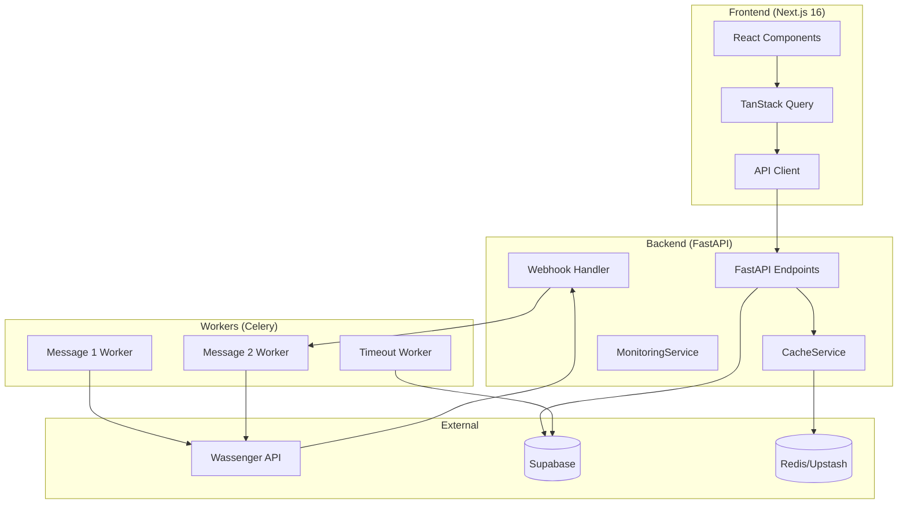
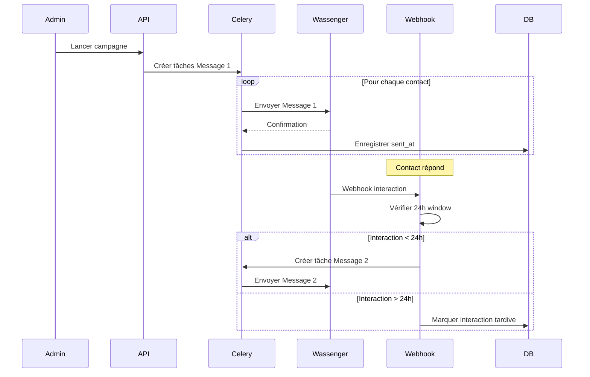

# Design Document: Comprehensive Audit 2025

## Overview

Ce document décrit l'architecture et les stratégies d'audit et d'optimisation pour la plateforme de gestion de campagnes WhatsApp. L'audit se concentre sur trois axes principaux :

1. **Audit de Performance** : Mesurer et optimiser les temps de réponse frontend et backend
2. **Audit de la Logique Métier** : Vérifier le bon fonctionnement de l'envoi Message 1 → Message 2
3. **Audit de Qualité** : Nettoyer le code et améliorer la maintenabilité

**Contrainte critique** : L'architecture existante doit être préservée. Seules des optimisations et corrections sont autorisées.

**Note sur les rôles** : Toutes les optimisations et fonctionnalités s'appliquent de manière identique pour les utilisateurs Admin et Super Admin. Il n'y a pas de différence de comportement entre ces deux rôles pour les fonctionnalités d'audit et d'optimisation.

## Architecture



## Components and Interfaces

### 1. Frontend Performance Audit

#### Métriques à Mesurer
| Métrique | Objectif | Outil de Mesure |
|----------|----------|-----------------|
| TTI | < 200ms | Lighthouse |
| FCP | < 100ms | Lighthouse |
| LCP | < 200ms | Lighthouse |
| Bundle Size | < 200KB | Webpack Bundle Analyzer |
| Re-renders | Minimal | React DevTools Profiler |

#### Points d'Optimisation
```typescript
// Configuration TanStack Query optimisée
const queryClient = new QueryClient({
  defaultOptions: {
    queries: {
      staleTime: 2 * 60 * 1000,  // 2 minutes
      gcTime: 10 * 60 * 1000,    // 10 minutes
      refetchOnWindowFocus: false,
      retry: 2,
    },
  },
});
```

### 2. Backend Performance Audit

#### Endpoints à Auditer
| Endpoint | Type | Objectif | Cache TTL |
|----------|------|----------|-----------|
| GET /messages/stats | GET | < 50ms | 60s |
| GET /categories | GET | < 50ms | 120s |
| GET /contacts | GET | < 50ms | 60s |
| POST /contacts | POST | < 100ms | - |
| POST /campaigns/start | POST | < 100ms | - |

#### Stratégie de Cache
```python
# Préfixes de clés cache (séparés de Celery)
CACHE_PREFIXES = {
    "stats": "cache:stats:",
    "categories": "cache:categories:",
    "contacts": "cache:contacts:",
}

# Clés protégées (ne pas toucher)
PROTECTED_PREFIXES = ("whatsapp:", "campaign:", "celery")
```

### 3. Logique d'Envoi Message 1 → Message 2

#### Flux de Données


#### Vérification 24h
```python
def is_within_24h_window(sent_at: datetime) -> bool:
    """Vérifie si le Message 1 a été envoyé il y a moins de 24h."""
    cutoff = datetime.utcnow() - timedelta(hours=24)
    return sent_at > cutoff
```

### 4. Prévention des Doublons Message 2

#### Verrou Distribué Redis
```python
def acquire_message_2_lock(campaign_id: str, contact_id: str) -> bool:
    """Acquiert un verrou pour éviter les doublons de Message 2."""
    lock_key = f"lock:message2:{campaign_id}:{contact_id}"
    return redis.set(lock_key, "1", nx=True, ex=300)  # 5 min TTL
```

### 5. Clôture Automatique des Campagnes

#### États Finaux
| État | Description |
|------|-------------|
| `message_2_sent` | Message 2 envoyé avec succès |
| `no_interaction` | Pas d'interaction après 24h |
| `late_interaction` | Interaction après 24h |
| `failed` | Échec définitif après retries |

#### Tâche Périodique
```python
@celery_app.task
def check_expired_interactions():
    """Exécutée toutes les heures pour marquer les timeouts 24h."""
    cutoff = datetime.utcnow() - timedelta(hours=24)
    # Trouver les Message 1 sans interaction après 24h
    # Marquer comme no_interaction
    # Mettre à jour les stats de campagne
```

## Data Models

### Messages Table
| Colonne | Type | Description |
|---------|------|-------------|
| id | UUID | Identifiant unique |
| campaign_id | UUID | FK vers campaigns |
| contact_id | UUID | FK vers contacts |
| message_type | ENUM | 'message_1' ou 'message_2' |
| status | ENUM | 'pending', 'sent', 'delivered', 'read', 'failed', 'no_interaction' |
| sent_at | TIMESTAMP | Timestamp d'envoi |
| created_at | TIMESTAMP | Timestamp de création |

### Interactions Table
| Colonne | Type | Description |
|---------|------|-------------|
| id | UUID | Identifiant unique |
| campaign_id | UUID | FK vers campaigns |
| contact_id | UUID | FK vers contacts |
| interaction_type | ENUM | 'text', 'emoji', 'voice', 'audio', 'image', 'video', 'document' |
| received_at | TIMESTAMP | Timestamp de réception |
| within_24h | BOOLEAN | Si l'interaction est dans les 24h |

## Correctness Properties

*A property is a characteristic or behavior that should hold true across all valid executions of a system-essentially, a formal statement about what the system should do. Properties serve as the bridge between human-readable specifications and machine-verifiable correctness guarantees.*

### Property 1: API Response Time Compliance

*For any* API endpoint, GET requests SHALL complete in less than 50ms and POST/PUT/DELETE requests SHALL complete in less than 100ms when the cache is warm.

**Validates: Requirements 2.1, 2.2**

### Property 2: Cache Degradation Resilience

*For any* cache operation when Redis is unavailable, the system SHALL return valid data from the database without raising an exception to the caller.

**Validates: Requirements 2.4**

### Property 3: Optimistic Update Consistency

*For any* create or delete mutation, the UI SHALL update immediately (< 50ms) and SHALL rollback automatically if the server returns an error.

**Validates: Requirements 3.1, 3.2, 3.3**

### Property 4: Message 1 Completeness

*For any* campaign with N contacts, after the campaign is launched, exactly N Message 1 records SHALL be created with non-null sent_at timestamps.

**Validates: Requirements 4.1, 4.2**

### Property 5: Rate Limiting Enforcement

*For any* 24-hour period, the system SHALL NOT send more than 1000 messages via Wassenger API.

**Validates: Requirements 4.4**

### Property 6: 24h Window Enforcement

*For any* interaction received, IF (current_time - message_1.sent_at) < 24 hours AND no Message 2 exists, THEN a Message 2 SHALL be created. IF (current_time - message_1.sent_at) >= 24 hours, THEN no Message 2 SHALL be created.

**Validates: Requirements 5.1, 5.2, 5.3**

### Property 7: Interaction Type Detection

*For any* webhook with interaction type in ['text', 'emoji', 'voice', 'audio', 'image', 'video', 'document'], the system SHALL detect and process the interaction.

**Validates: Requirements 5.4**

### Property 8: Message 2 Response Time

*For any* valid interaction (within 24h, no existing Message 2), the Message 2 SHALL be created within 5 seconds of webhook receipt.

**Validates: Requirements 5.5**

### Property 9: Interaction Recording

*For any* processed webhook, an interaction record SHALL exist in the interactions table with the correct campaign_id, contact_id, and interaction_type.

**Validates: Requirements 5.6**

### Property 10: Message 2 Idempotence

*For any* contact in a campaign, regardless of the number of interactions received, at most ONE Message 2 SHALL exist.

**Validates: Requirements 6.4**

### Property 11: Campaign Completion Logic

*For any* campaign where ALL contacts have a final state (message_2_sent, no_interaction, late_interaction, or failed), the campaign status SHALL be 'completed'.

**Validates: Requirements 7.1, 7.2**

### Property 12: Campaign Stats Calculation

*For any* completed campaign, the final statistics (sent_count, delivered_count, read_count, failed_count, interaction_count) SHALL be calculated and stored.

**Validates: Requirements 7.3, 9.5**

### Property 13: Campaign Timeout

*For any* campaign older than 48 hours, the campaign SHALL be marked as 'completed' regardless of contact states.

**Validates: Requirements 7.5**

### Property 14: Stats Content Completeness

*For any* stats response, the response SHALL include: total_contacts, messages_sent, messages_delivered, messages_read, interactions, failures.

**Validates: Requirements 9.2**

### Property 15: Stats Update Latency

*For any* message status change, the dashboard statistics SHALL reflect the change within 5 seconds.

**Validates: Requirements 9.3**

## Error Handling

### Webhook Processing Errors
```python
@router.post("/webhooks/wassenger")
async def handle_webhook(payload: dict):
    try:
        # Process webhook
        await process_webhook(payload)
    except Exception as e:
        # Log error but don't fail - webhooks should be idempotent
        logger.error(f"Webhook processing error: {e}")
        # Return 200 to prevent Wassenger from retrying
        return {"status": "error_logged"}
```

### Message Send Failures
```python
@celery_app.task(bind=True, max_retries=3)
def send_message(self, message_id: str):
    try:
        # Send message
        wassenger.send(message_id)
    except WassengerError as e:
        # Retry with exponential backoff
        raise self.retry(exc=e, countdown=2 ** self.request.retries)
```

### Cache Unavailable
```python
def get_stats_with_fallback():
    try:
        cached = cache.get("stats", "global")
        if cached:
            return cached
    except RedisError:
        logger.warning("Cache unavailable, falling back to DB")
    
    # Fallback to database
    return compute_stats_from_db()
```

## Testing Strategy

### Unit Tests
- Tester chaque fonction de validation (is_within_24h_window, etc.)
- Tester la génération des clés cache
- Tester la logique de détection d'interaction

### Property-Based Tests
Utiliser **Hypothesis** (Python) et **fast-check** (TypeScript) pour les tests property-based.

**Backend (Python/Hypothesis)**:
```python
from hypothesis import given, strategies as st

@given(st.datetimes(), st.datetimes())
def test_24h_window_enforcement(sent_at, interaction_at):
    """Property 6: 24h Window Enforcement"""
    # Test that the 24h logic is correct
    within_24h = is_within_24h_window(sent_at, interaction_at)
    expected = (interaction_at - sent_at) < timedelta(hours=24)
    assert within_24h == expected
```

**Frontend (TypeScript/fast-check)**:
```typescript
import * as fc from "fast-check";

test("Property 3: Optimistic Update Consistency", () => {
  fc.assert(
    fc.property(fc.integer({ min: 0 }), (initialCount) => {
      // After optimistic create, count should increase by 1
      const result = applyOptimisticCreate({ total: initialCount });
      return result.total === initialCount + 1;
    })
  );
});
```

### Integration Tests
- Tester le flux complet Message 1 → Interaction → Message 2
- Tester la clôture automatique de campagne
- Tester le comportement avec cache indisponible

### Performance Tests
- Mesurer les temps de réponse API avec et sans cache
- Mesurer les temps de chargement frontend avec Lighthouse
- Tester avec des volumes de données réalistes (10k+ contacts)

