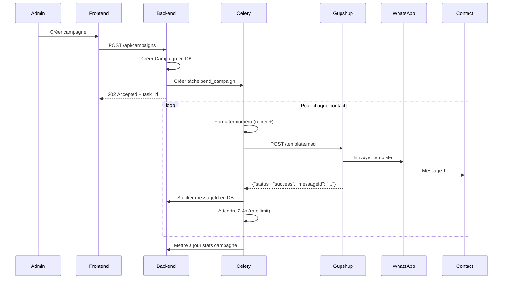
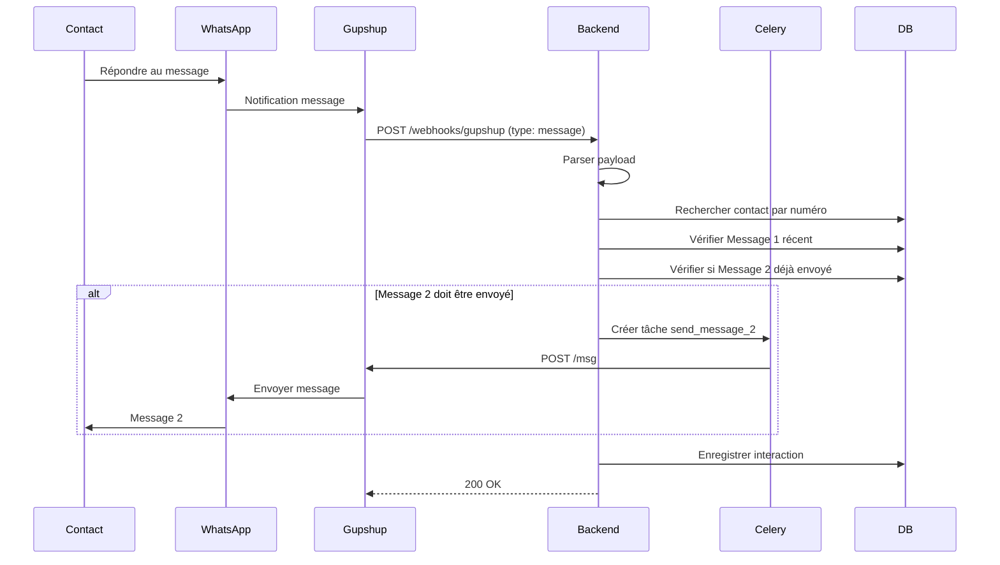

# Document de Conception - Migration WhatsApp Meta Cloud API vers Gupshup 2025

## Vue d'Ensemble

Cette migration remplace l'intégration WhatsApp Business API (Meta Cloud API) par Gupshup API (version 2025) dans le système de chatbot WhatsApp existant. La migration est conçue pour être transparente : le frontend, la base de données et la logique métier restent inchangés.

### Objectifs de Conception

- **Transparence** : Aucune modification du frontend Next.js ni du schéma de base de données
- **Compatibilité** : Même interface publique pour le nouveau service Gupshup
- **Fiabilité** : Conservation de toutes les fonctionnalités existantes (envoi, webhooks, retry, statistiques)
- **Maintenabilité** : Code commenté en français, documentation complète

### Différences Clés Meta vs Gupshup

| Aspect | Meta Cloud API | Gupshup API 2025 |
|--------|---------------|------------------|
| Authentification | Bearer Token | Header apikey |
| Format requête | JSON | x-www-form-urlencoded |
| Format numéro | +33612345678 | 33612345678 (sans +) |
| Endpoint template | /messages | /template/msg |
| Endpoint texte | /messages | /msg |
| Webhook format | Nested (entry.changes.value) | Flat (type, mobile, text) |

## Architecture

### Architecture de Migration

```
┌─────────────────────────────────────────────────────────────┐
│                  FRONTEND (Next.js 14+)                      │
│                    [AUCUNE MODIFICATION]                     │
└────────────────────────┬────────────────────────────────────┘
                         │
                         │ REST API (Axios)
                         ▼
┌─────────────────────────────────────────────────────────────┐
│                  BACKEND (FastAPI)                           │
│  ┌──────────────────────────────────────────────────────┐   │
│  │              COUCHE MODIFIÉE                          │   │
│  │  ┌────────────────────┐  ┌────────────────────────┐  │   │
│  │  │ gupshup_service.py │  │ routers/webhooks.py    │  │   │
│  │  │ (NOUVEAU)          │  │ (MODIFIÉ)              │  │   │
│  │  └────────────────────┘  └────────────────────────┘  │   │
│  │  ┌────────────────────┐  ┌────────────────────────┐  │   │
│  │  │ config.py          │  │ tasks/message_tasks.py │  │   │
│  │  │ (MODIFIÉ)          │  │ (MODIFIÉ)              │  │   │
│  │  └────────────────────┘  └────────────────────────┘  │   │
│  └──────────────────────────────────────────────────────┘   │
│  ┌──────────────────────────────────────────────────────┐   │
│  │              COUCHE INCHANGÉE                         │   │
│  │  Models, Schemas, Routers (auth, categories, etc.)   │   │
│  └──────────────────────────────────────────────────────┘   │
└────────────────────────┬────────────────────────────────────┘
                         │
                         │ HTTPS (x-www-form-urlencoded)
                         ▼
┌─────────────────────────────────────────────────────────────┐
│                  GUPSHUP API (2025)                          │
│  ┌──────────────────────────────────────────────────────┐   │
│  │  Endpoint: https://api.gupshup.io/sm/api/v1          │   │
│  │  - POST /template/msg (Message 1 - Templates)        │   │
│  │  - POST /msg (Message 2 - Texte libre)               │   │
│  └──────────────────────────────────────────────────────┘   │
└────────────────────────┬────────────────────────────────────┘
                         │
                         │ Webhooks
                         ▼
┌─────────────────────────────────────────────────────────────┐
│                  SUPABASE (PostgreSQL)                       │
│                    [AUCUNE MODIFICATION]                     │
└─────────────────────────────────────────────────────────────┘
```

### Flux d'Envoi de Message (Gupshup)

```
Admin → Configure Campagne → POST /api/campaigns
→ Backend crée Campaign → Celery Task créée
→ Celery Worker → Pour chaque contact:
    1. Formater numéro (retirer +)
    2. Construire payload x-www-form-urlencoded
    3. POST https://api.gupshup.io/sm/api/v1/template/msg
    4. Parser réponse {"status": "success", "messageId": "..."}
    5. Stocker messageId dans messages.whatsapp_message_id
    6. Attendre 2.4s (rate limit 25/min)
→ Mettre à jour statistiques campagne
```

### Flux de Webhook (Gupshup)

```
Gupshup → POST /api/webhooks/gupshup
→ Parser payload:
   - type: "message" → Message client reçu
   - type: "message-event" → Statut de livraison
→ Si type="message":
    1. Extraire mobile, text, messageId
    2. Rechercher contact par numéro
    3. Vérifier si Message 2 doit être envoyé
    4. Créer tâche Celery pour Message 2
    5. Enregistrer interaction
→ Si type="message-event":
    1. Extraire eventType (delivered, read, failed)
    2. Mettre à jour statut message
    3. Incrémenter compteurs campagne
→ Retourner 200 OK
```

## Composants et Interfaces

### Fichiers à Créer

#### 1. services/gupshup_service.py (NOUVEAU)

```python
"""
Service Gupshup API 2025 - Intégration avec Gupshup WhatsApp API
Remplace whatsapp_service.py pour la migration
"""

@dataclass
class GupshupResponse:
    """Réponse de l'API Gupshup"""
    success: bool
    message_id: Optional[str] = None
    error_code: Optional[str] = None
    error_message: Optional[str] = None
    raw_response: Optional[Dict[str, Any]] = None


@dataclass
class GupshupWebhookInteraction:
    """Interaction parsée depuis un webhook Gupshup"""
    contact_phone: str
    interaction_type: str  # 'reply', 'delivered', 'read', 'failed'
    content: Optional[str] = None
    gupshup_message_id: Optional[str] = None
    external_id: Optional[str] = None
    timestamp: Optional[datetime] = None


class GupshupService:
    """
    Service pour l'intégration avec Gupshup API 2025.
    Interface compatible avec l'ancien WhatsAppService.
    """
    
    def __init__(self):
        self.api_key = settings.GUPSHUP_API_KEY
        self.app_name = settings.GUPSHUP_APP_NAME
        self.phone_number = settings.GUPSHUP_PHONE_NUMBER
        self.base_url = settings.GUPSHUP_API_URL
    
    @property
    def template_url(self) -> str:
        """URL de l'endpoint templates"""
        return f"{self.base_url}/template/msg"
    
    @property
    def message_url(self) -> str:
        """URL de l'endpoint messages"""
        return f"{self.base_url}/msg"
    
    @property
    def headers(self) -> Dict[str, str]:
        """Headers pour les requêtes API"""
        return {
            "apikey": self.api_key,
            "Content-Type": "application/x-www-form-urlencoded",
        }
    
    def format_phone_number(self, phone: str) -> str:
        """
        Formate le numéro de téléphone pour Gupshup (sans +).
        
        Args:
            phone: Numéro avec ou sans +
        
        Returns:
            Numéro sans le caractère +
        """
        return phone.lstrip("+")
    
    async def send_template_message(
        self,
        phone: str,
        template_name: str,
        params: List[str] = None,
        language_code: str = "fr"
    ) -> GupshupResponse:
        """
        Envoie un message template WhatsApp (Message 1).
        
        Args:
            phone: Numéro de téléphone
            template_name: Nom du template approuvé sur Gupshup
            params: Liste des paramètres du template
            language_code: Code langue (non utilisé par Gupshup mais gardé pour compatibilité)
        
        Returns:
            GupshupResponse avec le résultat de l'envoi
        """
        # Formater le numéro
        destination = self.format_phone_number(phone)
        
        # Construire le template JSON
        template_data = {"id": template_name}
        if params:
            template_data["params"] = params
        
        # Construire le payload x-www-form-urlencoded
        data = {
            "channel": "whatsapp",
            "source": self.app_name,
            "destination": destination,
            "template": json.dumps(template_data),
            "src.name": self.app_name
        }
        
        return await self._send_request(self.template_url, data)
    
    async def send_text_message(
        self,
        phone: str,
        text: str,
        preview_url: bool = True
    ) -> GupshupResponse:
        """
        Envoie un message texte libre WhatsApp (Message 2).
        
        Args:
            phone: Numéro de téléphone
            text: Contenu du message texte
            preview_url: Non utilisé par Gupshup mais gardé pour compatibilité
        
        Returns:
            GupshupResponse avec le résultat de l'envoi
        """
        # Formater le numéro
        destination = self.format_phone_number(phone)
        
        # Construire le payload x-www-form-urlencoded
        data = {
            "channel": "whatsapp",
            "source": self.app_name,
            "destination": destination,
            "message": text,
            "src.name": self.app_name
        }
        
        return await self._send_request(self.message_url, data)
    
    async def _send_request(self, url: str, data: Dict[str, str]) -> GupshupResponse:
        """Envoie une requête à l'API Gupshup."""
        # Implémentation avec httpx et gestion d'erreurs
        pass
    
    def parse_webhook_payload(self, payload: Dict[str, Any]) -> List[GupshupWebhookInteraction]:
        """
        Parse le payload d'un webhook Gupshup.
        
        Format message:
        {
            "type": "message",
            "mobile": "33612345678",
            "text": "message du client",
            "messageId": "gBEGVzU...",
            "timestamp": 1234567890,
            "name": "Nom du contact"
        }
        
        Format message-event:
        {
            "type": "message-event",
            "eventType": "delivered" | "read" | "failed",
            "externalId": "msg_id",
            "messageId": "gBEGVzU..."
        }
        """
        pass


# Instance singleton du service
gupshup_service = GupshupService()
```

### Fichiers à Modifier

#### 2. config.py (MODIFIÉ)

Nouvelles variables à ajouter :

```python
class Settings(BaseSettings):
    # ... variables existantes ...
    
    # Gupshup API (2025) - NOUVELLES VARIABLES
    GUPSHUP_API_KEY: str = ""
    GUPSHUP_APP_NAME: str = ""
    GUPSHUP_PHONE_NUMBER: str = ""
    GUPSHUP_API_URL: str = "https://api.gupshup.io/sm/api/v1"
    GUPSHUP_CUSTOMER_ID: str = ""
    
    # Anciennes variables Meta (conservées pour rétrocompatibilité)
    WHATSAPP_PHONE_NUMBER_ID: str = ""
    WHATSAPP_ACCESS_TOKEN: str = ""
    WHATSAPP_WEBHOOK_VERIFY_TOKEN: str = ""
    WHATSAPP_API_VERSION: str = "v18.0"
```

#### 3. routers/webhooks.py (MODIFIÉ)

Ajouter le nouvel endpoint Gupshup :

```python
@router.post("/gupshup", status_code=status.HTTP_200_OK)
async def receive_gupshup_webhook(
    request: Request,
    background_tasks: BackgroundTasks,
    db: SupabaseDB = Depends(get_supabase_db),
) -> Dict[str, str]:
    """
    Endpoint de réception des webhooks Gupshup.
    
    Gère deux types de webhooks:
    - type: "message" → Message client reçu
    - type: "message-event" → Statut de livraison
    """
    try:
        payload = await request.json()
        
        webhook_type = payload.get("type")
        
        if webhook_type == "message":
            # Traiter le message entrant
            background_tasks.add_task(
                process_gupshup_message,
                payload,
                db
            )
        elif webhook_type == "message-event":
            # Traiter le statut de livraison
            background_tasks.add_task(
                process_gupshup_status,
                payload,
                db
            )
        
        return {"status": "received"}
        
    except Exception as e:
        logger.exception(f"Erreur webhook Gupshup: {str(e)}")
        return {"status": "error_logged"}
```

#### 4. tasks/message_tasks.py (MODIFIÉ)

Remplacer l'import et l'utilisation du service :

```python
# AVANT
from app.services.whatsapp_service import whatsapp_service

# APRÈS
from app.services.gupshup_service import gupshup_service

# Dans les tâches, remplacer:
# result = await whatsapp_service.send_template_message(...)
# Par:
# result = await gupshup_service.send_template_message(...)
```

### Fichiers à Supprimer/Archiver

- `services/whatsapp_service.py` → Archiver ou supprimer après migration

## Modèles de Données

### Aucune Modification du Schéma

Le schéma de base de données reste inchangé. Le champ `whatsapp_message_id` dans la table `messages` sera utilisé pour stocker l'ID Gupshup.

```sql
-- Table messages (INCHANGÉE)
CREATE TABLE messages (
    id SERIAL PRIMARY KEY,
    campaign_id INTEGER REFERENCES campaigns(id),
    contact_id INTEGER REFERENCES contacts(id),
    message_type VARCHAR(20),
    content TEXT NOT NULL,
    status VARCHAR(50) DEFAULT 'pending',
    whatsapp_message_id VARCHAR(255),  -- Stockera l'ID Gupshup
    error_message TEXT,
    retry_count INTEGER DEFAULT 0,
    sent_at TIMESTAMP,
    delivered_at TIMESTAMP,
    read_at TIMESTAMP,
    created_at TIMESTAMP DEFAULT CURRENT_TIMESTAMP,
    updated_at TIMESTAMP DEFAULT CURRENT_TIMESTAMP
);
```

## Propriétés de Correction

*Une propriété est une caractéristique ou un comportement qui devrait être vrai pour toutes les exécutions valides d'un système - essentiellement, une déclaration formelle sur ce que le système devrait faire. Les propriétés servent de pont entre les spécifications lisibles par l'homme et les garanties de correction vérifiables par machine.*

### Propriété 1 : Formatage des numéros de téléphone
*Pour tout* numéro de téléphone passé au service Gupshup, le caractère "+" doit être retiré du début du numéro
**Valide : Exigences 2.3, 7.2**

### Propriété 2 : Format des requêtes template
*Pour toute* requête d'envoi de template, le payload doit contenir les champs obligatoires : channel="whatsapp", source, destination, template (JSON), src.name
**Valide : Exigences 2.2**

### Propriété 3 : Encodage JSON des paramètres template
*Pour toute* liste de paramètres de template, l'encodage doit produire un JSON valide avec la structure {"id": "template_name", "params": [...]}
**Valide : Exigences 2.4**

### Propriété 4 : Format des requêtes message texte
*Pour toute* requête d'envoi de message texte, le payload doit contenir les champs obligatoires : channel="whatsapp", source, destination, message, src.name
**Valide : Exigences 3.2**

### Propriété 5 : Encodage des caractères spéciaux
*Pour tout* message contenant des caractères spéciaux (émojis, accents, symboles), l'encodage x-www-form-urlencoded doit préserver le contenu
**Valide : Exigences 3.4**

### Propriété 6 : Parsing des webhooks message
*Pour tout* webhook Gupshup de type "message", le parsing doit extraire correctement les champs mobile, text et messageId
**Valide : Exigences 4.1**

### Propriété 7 : Parsing des webhooks message-event
*Pour tout* webhook Gupshup de type "message-event", le parsing doit extraire correctement le eventType parmi (sent, delivered, read, failed)
**Valide : Exigences 5.1**

### Propriété 8 : Temps de réponse webhook
*Pour tout* webhook reçu, le traitement doit retourner un statut 200 OK en moins de 20 secondes
**Valide : Exigences 4.6**

### Propriété 9 : Respect du rate limiting
*Pour tout* envoi massif de messages, le système ne doit jamais dépasser 25 messages par minute
**Valide : Exigences 6.2**

### Propriété 10 : Calcul du délai de retry exponentiel
*Pour tout* retry de message échoué, le délai doit suivre la formule : délai = 60 × 2^(tentative-1) secondes
**Valide : Exigences 6.3**

### Propriété 11 : Cohérence des formats de réponse API
*Pour tout* appel API du frontend, le format de réponse doit être identique à celui de l'ancienne implémentation Meta
**Valide : Exigences 8.5**

### Propriété 12 : Cohérence du calcul des statistiques
*Pour toute* campagne, le calcul des statistiques (taux de réussite, compteurs) doit produire les mêmes résultats qu'avant la migration
**Valide : Exigences 7.5**

## Gestion des Erreurs

### Erreurs API Gupshup

| Code Erreur | Description | Action |
|-------------|-------------|--------|
| 401 | API Key invalide | Logger erreur critique, ne pas retry |
| 429 | Rate limit dépassé | Attendre et retry avec backoff |
| 500 | Erreur serveur Gupshup | Retry avec backoff exponentiel |
| timeout | Requête expirée | Retry immédiat (max 1 fois) |

### Stratégie de Retry

```python
def calculate_retry_delay(attempt: int) -> int:
    """
    Calcule le délai avant le prochain retry.
    
    Args:
        attempt: Numéro de la tentative (1, 2, 3)
    
    Returns:
        Délai en secondes (60, 120, 240)
    """
    base_delay = 60  # 1 minute
    return base_delay * (2 ** (attempt - 1))
```

### Logging

Tous les événements importants sont loggés :
- Envoi de message (succès/échec)
- Réception de webhook
- Mise à jour de statut
- Erreurs API avec contexte complet

## Stratégie de Tests

### Tests Unitaires

1. **test_phone_formatting** : Vérifier que format_phone_number retire le +
2. **test_template_payload** : Vérifier le format du payload template
3. **test_message_payload** : Vérifier le format du payload message
4. **test_webhook_parsing_message** : Vérifier le parsing des webhooks message
5. **test_webhook_parsing_event** : Vérifier le parsing des webhooks message-event
6. **test_retry_delay_calculation** : Vérifier le calcul du délai exponentiel

### Tests Property-Based (avec Hypothesis)

La bibliothèque **Hypothesis** sera utilisée pour les tests property-based en Python.

Configuration minimale : 100 itérations par test.

Format d'annotation des tests :
```python
# **Feature: migration-gupshup, Property 1: Formatage des numéros de téléphone**
@given(phone_number=st.text(min_size=10, max_size=15).filter(lambda x: x.startswith("+")))
def test_phone_formatting_removes_plus(phone_number):
    result = gupshup_service.format_phone_number(phone_number)
    assert not result.startswith("+")
```

### Tests d'Intégration

1. **test_send_template_integration** : Envoi réel d'un template (avec mock ou sandbox)
2. **test_send_message_integration** : Envoi réel d'un message texte
3. **test_webhook_flow** : Simulation complète du flux webhook
4. **test_campaign_flow** : Test du flux complet de campagne

## Configuration

### Variables d'Environnement (.env)

```bash
# =============================================================================
# GUPSHUP API (2025) - NOUVELLE CONFIGURATION
# =============================================================================

# Clé API Gupshup (trouvée dans Gupshup Dashboard > Settings > API Keys)
GUPSHUP_API_KEY=your_gupshup_api_key

# Nom de l'application Gupshup
GUPSHUP_APP_NAME=newsteck

# Numéro de téléphone WhatsApp (sans +)
GUPSHUP_PHONE_NUMBER=33753117215

# URL de base de l'API Gupshup
GUPSHUP_API_URL=https://api.gupshup.io/sm/api/v1

# ID Client Gupshup (optionnel)
GUPSHUP_CUSTOMER_ID=4000322028

# =============================================================================
# ANCIENNES VARIABLES META (peuvent être supprimées après migration)
# =============================================================================
# WHATSAPP_PHONE_NUMBER_ID=...
# WHATSAPP_ACCESS_TOKEN=...
# WHATSAPP_WEBHOOK_VERIFY_TOKEN=...
```

### Configuration Webhook sur Gupshup Dashboard

URL à configurer :
- **Local (ngrok)** : `https://xyz.ngrok.io/api/webhooks/gupshup`
- **Production** : `https://votre-api.com/api/webhooks/gupshup`

## Diagramme de Séquence - Envoi Message 1



## Diagramme de Séquence - Webhook Message 2


