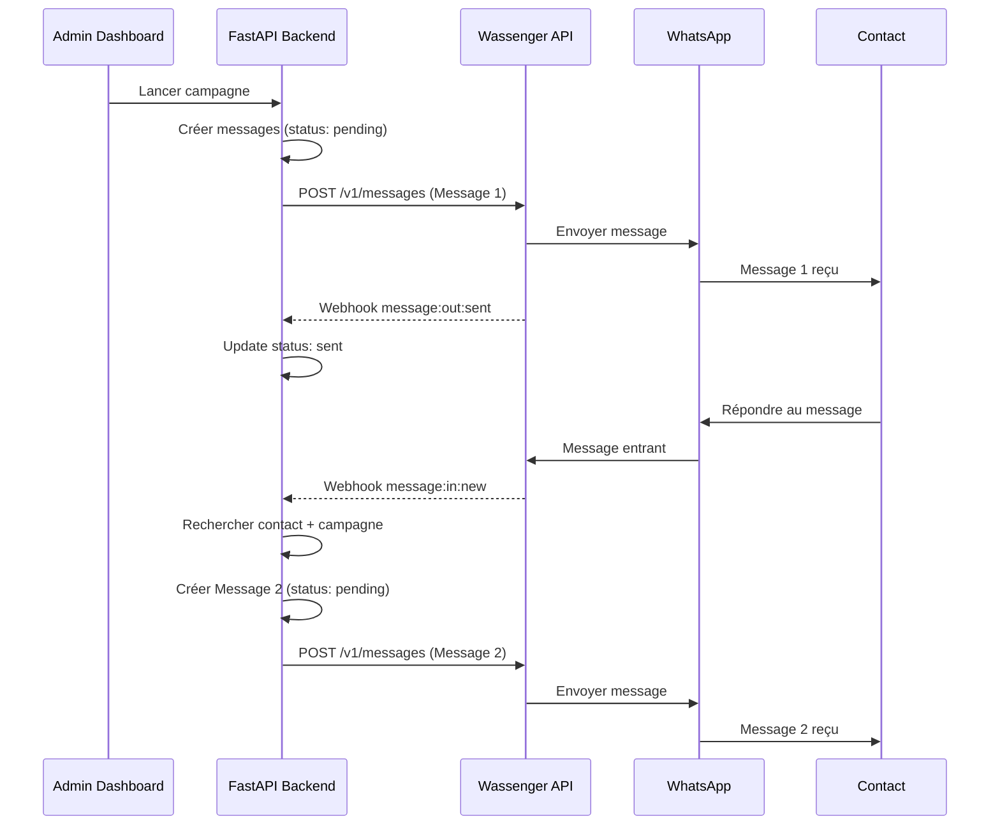
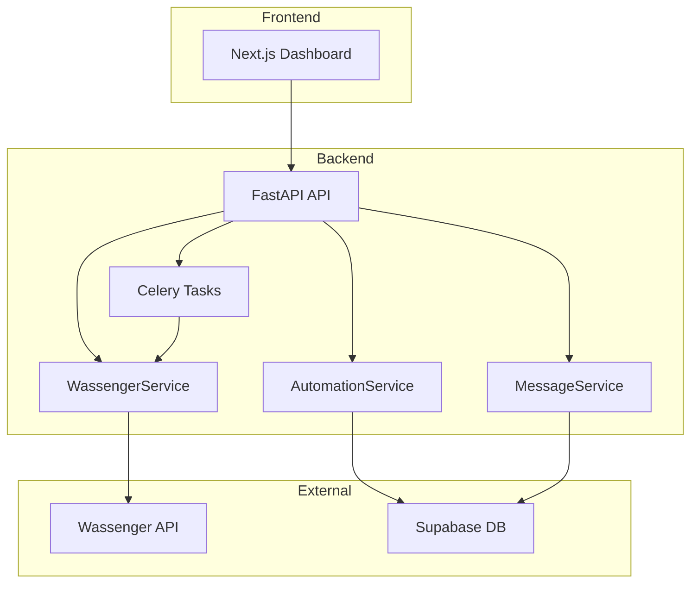

# Design Document: Migration Twilio Sandbox → Wassenger 2025

## Overview

Ce document décrit l'architecture et le design technique pour la migration du système de chatbot WhatsApp de Twilio Sandbox vers Wassenger 2025. La migration implique le remplacement complet du service d'envoi de messages, du parsing des webhooks, et de la gestion des erreurs, tout en conservant la compatibilité avec le workflow existant et la structure de base de données.

### Objectifs Principaux

1. **Remplacer TwilioService par WassengerService** - Nouveau service avec interface compatible
2. **Adapter le parsing des webhooks** - Nouveau format de payload Wassenger
3. **Mettre à jour la configuration** - Nouvelles variables d'environnement
4. **Créer la documentation** - 3 guides MD en français
5. **Archiver le code Twilio** - Nettoyage de la base de code

### Contraintes Techniques

- Python 3.10+ avec FastAPI
- Utilisation de httpx pour les requêtes HTTP async
- Compatibilité avec Celery pour les tâches asynchrones
- Conservation du schéma de base de données existant (Supabase)

## Architecture

### Diagramme de Flux



### Architecture des Composants



## Components and Interfaces

### 1. WassengerService (backend/app/services/wassenger_service.py)

Service principal pour l'intégration avec l'API Wassenger.

```python
@dataclass
class WassengerResponse:
    """Réponse de l'API Wassenger."""
    success: bool
    message_id: Optional[str] = None
    error_code: Optional[str] = None
    error_message: Optional[str] = None
    raw_response: Optional[Dict[str, Any]] = None

@dataclass
class WassengerWebhookInteraction:
    """Interaction parsée depuis un webhook Wassenger."""
    contact_phone: str
    interaction_type: str  # 'reply', 'sent', 'delivered', 'read', 'failed'
    content: Optional[str] = None
    wassenger_message_id: Optional[str] = None
    timestamp: Optional[datetime] = None
    error_message: Optional[str] = None

class WassengerService:
    """Service pour l'intégration avec Wassenger API 2025."""
    
    BASE_URL = "https://api.wassenger.com/v1"
    
    def __init__(self):
        self.api_key = settings.WASSENGER_API_KEY
        self.device_id = settings.WASSENGER_DEVICE_ID
        self.client = httpx.AsyncClient(
            headers={"Authorization": f"Bearer {self.api_key}"},
            timeout=30.0
        )
    
    def format_phone_number(self, phone: str) -> str:
        """Formate le numéro sans le préfixe + (format Wassenger)."""
        ...
    
    async def send_message(self, phone: str, text: str) -> WassengerResponse:
        """Envoie un message texte via Wassenger API."""
        ...
    
    def parse_webhook_payload(self, payload: Dict[str, Any]) -> List[WassengerWebhookInteraction]:
        """Parse le payload d'un webhook Wassenger."""
        ...
    
    @staticmethod
    def get_error_details(error_code: str) -> Dict[str, Any]:
        """Retourne les détails d'une erreur Wassenger avec message utilisateur."""
        ...
```

### 2. Webhook Router (backend/app/routers/webhooks.py)

Nouvel endpoint pour les webhooks Wassenger.

```python
@router.post("/wassenger", status_code=status.HTTP_200_OK)
async def receive_wassenger_webhook(
    request: Request,
    background_tasks: BackgroundTasks,
    db: SupabaseDB = Depends(get_supabase_db),
) -> Dict[str, str]:
    """
    Endpoint de réception des webhooks Wassenger.
    
    Événements supportés:
    - message:in:new : Message entrant d'un contact
    - message:out:sent : Message envoyé avec succès
    - message:out:delivered : Message délivré
    - message:out:read : Message lu
    - message:out:failed : Échec d'envoi
    """
    ...
```

### 3. Configuration (backend/app/config.py)

Nouvelles variables d'environnement.

```python
class Settings(BaseSettings):
    # Wassenger API 2025
    WASSENGER_API_KEY: str = ""
    WASSENGER_DEVICE_ID: str = ""
    WASSENGER_WEBHOOK_URL: str = ""
    
    def validate_wassenger_config(self) -> None:
        """Valide que les variables Wassenger obligatoires sont configurées."""
        ...
```

## Data Models

### Structures de Données Wassenger

#### Payload d'Envoi de Message

```json
{
  "phone": "22890123456",
  "message": "Contenu du message",
  "device": "device_id_here"
}
```

#### Réponse de Succès

```json
{
  "id": "msg_abc123",
  "status": "queued",
  "phone": "22890123456",
  "message": "Contenu du message",
  "device": "device_id_here",
  "createdAt": "2025-01-15T10:30:00Z"
}
```

#### Webhook Message Entrant (message:in:new)

```json
{
  "event": "message:in:new",
  "data": {
    "id": "msg_xyz789",
    "fromNumber": "22890123456",
    "body": "Réponse du contact",
    "timestamp": "2025-01-15T10:35:00Z",
    "device": "device_id_here"
  }
}
```

#### Webhook Statut de Livraison

```json
{
  "event": "message:out:delivered",
  "data": {
    "id": "msg_abc123",
    "status": "delivered",
    "timestamp": "2025-01-15T10:31:00Z"
  }
}
```

### Mapping des Statuts

| Événement Wassenger | Statut Base de Données |
|---------------------|------------------------|
| message:out:sent | sent |
| message:out:delivered | delivered |
| message:out:read | read |
| message:out:failed | failed |

### Codes d'Erreur Wassenger

| Code Erreur | Message Utilisateur |
|-------------|---------------------|
| device_not_connected | L'appareil WhatsApp doit être reconnecté via QR code dans le dashboard Wassenger |
| invalid_phone_number | Le format du numéro de téléphone est incorrect. Utilisez le format international sans + |
| rate_limit_exceeded | Limite de débit atteinte. Réessai automatique dans 60 secondes |
| session_expired | La session WhatsApp a expiré. Reconnectez l'appareil dans le dashboard Wassenger |
| message_too_long | Le message dépasse la limite de 4096 caractères |

## Correctness Properties

*A property is a characteristic or behavior that should hold true across all valid executions of a system-essentially, a formal statement about what the system should do. Properties serve as the bridge between human-readable specifications and machine-verifiable correctness guarantees.*

### Property 1: Phone Number Formatting

*For any* phone number string (with or without +, with or without spaces), formatting it for Wassenger should produce a string containing only digits without the + prefix.

**Validates: Requirements 2.2**

### Property 2: Webhook Payload Parsing

*For any* valid Wassenger webhook payload with event type "message:in:new", parsing should extract the contact phone number from data.fromNumber, the message content from data.body, and the message ID from data.id.

**Validates: Requirements 3.1, 3.2**

### Property 3: Webhook Status Mapping

*For any* Wassenger webhook event of type message:out:sent, message:out:delivered, message:out:read, or message:out:failed, the parsed interaction_type should match the expected status mapping (sent, delivered, read, failed respectively).

**Validates: Requirements 3.3, 3.4, 3.5, 3.6**

### Property 4: Error Message Mapping

*For any* known Wassenger error code (device_not_connected, invalid_phone_number, session_expired), the error details function should return a non-empty user-friendly message in French.

**Validates: Requirements 7.1, 7.2, 7.4**

### Property 5: Exponential Retry Delay Calculation

*For any* retry attempt number n (1, 2, or 3), the calculated delay should equal 60 × 2^(n-1) seconds (60s, 120s, 240s).

**Validates: Requirements 2.6, 6.4**

### Property 6: Configuration Validation

*For any* configuration where WASSENGER_API_KEY or WASSENGER_DEVICE_ID is empty or missing, validation should raise a ValueError with a message containing the name of the missing variable.

**Validates: Requirements 1.1, 1.2, 5.4**

### Property 7: API Response Parsing - Success

*For any* successful Wassenger API response containing an "id" field, parsing should extract the message_id and set success to True.

**Validates: Requirements 2.3**

### Property 8: API Response Parsing - Error

*For any* Wassenger API error response containing "error" and "message" fields, parsing should extract both values and set success to False.

**Validates: Requirements 2.4**

### Property 9: Device ID Inclusion in Requests

*For any* message send request, the payload should contain the device field with the configured WASSENGER_DEVICE_ID value.

**Validates: Requirements 1.4, 2.1**

## Error Handling

### Stratégie de Gestion des Erreurs

1. **Erreurs de Configuration** : Levées au démarrage avec message explicite
2. **Erreurs API** : Parsées et stockées dans error_message du message
3. **Erreurs Réseau** : Retry automatique avec backoff exponentiel
4. **Erreurs Webhook** : Loggées mais retour 200 OK pour éviter les retries

### Codes HTTP Retournés

| Situation | Code HTTP |
|-----------|-----------|
| Webhook traité avec succès | 200 OK |
| Payload webhook invalide | 200 OK (avec log d'erreur) |
| Erreur interne | 200 OK (avec log d'erreur) |

Note: On retourne toujours 200 OK pour les webhooks afin d'éviter que Wassenger ne réessaie indéfiniment.

### Logging

```python
# Niveaux de log utilisés
logger.info("Message envoyé avec succès")
logger.warning("Erreur Wassenger récupérable: device_not_connected")
logger.error("Erreur API Wassenger: {code} - {message}")
logger.exception("Erreur inattendue lors du traitement")
```

## Testing Strategy

### Approche Duale : Tests Unitaires et Property-Based Testing

Les tests unitaires et les property-based tests sont complémentaires :
- **Tests unitaires** : Vérifient des exemples spécifiques et des cas limites
- **Property-based tests** : Vérifient des propriétés universelles sur des entrées générées aléatoirement

### Framework de Property-Based Testing

**Bibliothèque choisie** : Hypothesis (Python)

Hypothesis est la bibliothèque de property-based testing la plus mature pour Python. Elle génère automatiquement des cas de test et trouve les contre-exemples minimaux.

### Configuration des Tests

```python
from hypothesis import given, settings, strategies as st

# Configuration globale : minimum 100 itérations par test
settings.register_profile("ci", max_examples=100)
settings.load_profile("ci")
```

### Structure des Tests

```
backend/tests/
├── test_wassenger_service.py      # Tests unitaires du service
├── test_wassenger_properties.py   # Property-based tests
└── conftest.py                    # Fixtures et générateurs
```

### Générateurs Hypothesis

```python
# Générateur de numéros de téléphone
phone_numbers = st.from_regex(r'\+?[0-9]{8,15}', fullmatch=True)

# Générateur de payloads webhook
webhook_events = st.sampled_from([
    "message:in:new",
    "message:out:sent", 
    "message:out:delivered",
    "message:out:read",
    "message:out:failed"
])

# Générateur de codes d'erreur
error_codes = st.sampled_from([
    "device_not_connected",
    "invalid_phone_number",
    "rate_limit_exceeded",
    "session_expired"
])
```

### Annotation des Tests

Chaque property-based test doit être annoté avec le format suivant :

```python
@given(phone=phone_numbers)
def test_phone_formatting_property(phone):
    """
    **Feature: migration-wassenger-2025, Property 1: Phone Number Formatting**
    **Validates: Requirements 2.2**
    """
    ...
```
