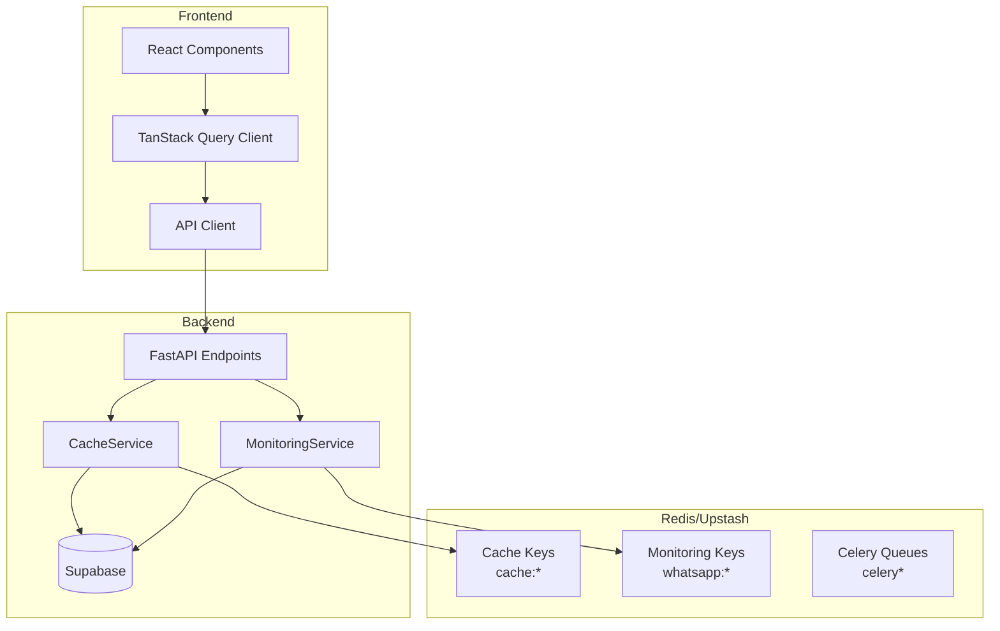

# Design Document: Performance Optimization

## Overview

Ce document décrit l'architecture technique pour optimiser les performances de l'application WhatsApp Chatbot. L'optimisation se concentre sur trois axes :

1. **Cache Backend** : Ajout d'une couche de cache Redis pour les données fréquemment lues (stats, catégories)
2. **Optimisation Frontend** : Configuration TanStack Query pour réduire les requêtes et améliorer la réactivité
3. **Optimisation SQL** : Agrégation des requêtes pour réduire les appels à la base de données

**Contrainte critique** : Le système Redis existant (Upstash) gère déjà Celery, l'envoi de messages et le monitoring. L'optimisation doit être **additive** et ne pas interférer avec ces fonctionnalités.

## Architecture



## Components and Interfaces

### 1. CacheService (Backend)

Nouveau service de cache qui s'intègre avec l'infrastructure Redis existante.

```python
# backend/app/services/cache_service.py

from typing import Optional, Any, List
from datetime import timedelta
import json
import redis
import logging

logger = logging.getLogger(__name__)

class CacheService:
    """
    Service de cache applicatif utilisant Redis.
    
    Préfixes de clés:
    - cache:stats:* - Statistiques globales
    - cache:categories:* - Données de catégories
    - cache:contacts:count:* - Comptages de contacts
    
    Ne doit PAS interférer avec:
    - whatsapp:* - Compteurs monitoring
    - campaign:* - Verrous de campagne
    - celery* - Queues Celery
    """
    
    PROTECTED_PREFIXES = ("whatsapp:", "campaign:", "celery")
    CACHE_PREFIX = "cache:"
    
    DEFAULT_TTL = timedelta(seconds=60)
    STATS_TTL = timedelta(seconds=60)
    CATEGORIES_TTL = timedelta(seconds=120)
    
    def __init__(self, redis_client: redis.Redis):
        self.redis = redis_client
        self._hits = 0
        self._misses = 0
    
    def _make_key(self, namespace: str, key: str) -> str:
        """Génère une clé cache avec le préfixe approprié."""
        return f"{self.CACHE_PREFIX}{namespace}:{key}"
    
    def _is_protected_key(self, key: str) -> bool:
        """Vérifie si une clé est protégée (ne doit pas être modifiée)."""
        return any(key.startswith(prefix) for prefix in self.PROTECTED_PREFIXES)
    
    def get(self, namespace: str, key: str) -> Optional[Any]:
        """Récupère une valeur du cache."""
        cache_key = self._make_key(namespace, key)
        try:
            value = self.redis.get(cache_key)
            if value:
                self._hits += 1
                return json.loads(value)
            self._misses += 1
            return None
        except Exception as e:
            logger.warning(f"Cache get error: {e}")
            self._misses += 1
            return None
    
    def set(self, namespace: str, key: str, value: Any, ttl: timedelta = None) -> bool:
        """Stocke une valeur dans le cache."""
        cache_key = self._make_key(namespace, key)
        if self._is_protected_key(cache_key):
            logger.error(f"Attempted to write to protected key: {cache_key}")
            return False
        
        try:
            ttl = ttl or self.DEFAULT_TTL
            self.redis.setex(cache_key, int(ttl.total_seconds()), json.dumps(value))
            return True
        except Exception as e:
            logger.warning(f"Cache set error: {e}")
            return False
    
    def delete(self, namespace: str, key: str) -> bool:
        """Supprime une entrée du cache."""
        cache_key = self._make_key(namespace, key)
        try:
            self.redis.delete(cache_key)
            return True
        except Exception as e:
            logger.warning(f"Cache delete error: {e}")
            return False
    
    def invalidate_pattern(self, pattern: str) -> int:
        """Invalide toutes les clés correspondant au pattern."""
        full_pattern = f"{self.CACHE_PREFIX}{pattern}"
        try:
            keys = list(self.redis.scan_iter(match=full_pattern))
            if keys:
                # Vérifier qu'aucune clé protégée n'est dans la liste
                safe_keys = [k for k in keys if not self._is_protected_key(k)]
                if safe_keys:
                    return self.redis.delete(*safe_keys)
            return 0
        except Exception as e:
            logger.warning(f"Cache invalidate pattern error: {e}")
            return 0
    
    def invalidate_stats(self) -> None:
        """Invalide tous les caches de statistiques."""
        self.invalidate_pattern("stats:*")
    
    def invalidate_categories(self) -> None:
        """Invalide tous les caches de catégories."""
        self.invalidate_pattern("categories:*")
    
    def get_metrics(self) -> dict:
        """Retourne les métriques du cache."""
        total = self._hits + self._misses
        hit_rate = (self._hits / total * 100) if total > 0 else 0
        return {
            "hits": self._hits,
            "misses": self._misses,
            "total": total,
            "hit_rate": round(hit_rate, 2)
        }
```

### 2. Intégration avec les Endpoints

```python
# Exemple d'intégration dans backend/app/routers/messages.py

from app.services.cache_service import CacheService, get_cache_service

@router.get("/stats", response_model=MessageStats)
async def get_global_stats(
    cache: CacheService = Depends(get_cache_service),
    db: SupabaseDB = Depends(get_supabase_db),
    current_user: Dict = Depends(get_current_user)
) -> MessageStats:
    """Récupère les statistiques avec cache."""
    
    # Essayer le cache d'abord
    cached = cache.get("stats", "messages_global")
    if cached:
        return MessageStats(**cached)
    
    # Fallback sur la DB avec requête optimisée
    stats = await _compute_message_stats(db)
    
    # Mettre en cache
    cache.set("stats", "messages_global", stats.dict(), CacheService.STATS_TTL)
    
    return stats
```

### 3. Configuration Frontend TanStack Query

```typescript
// frontend/src/lib/query-client.ts

import { QueryClient } from "@tanstack/react-query";

export const queryClient = new QueryClient({
  defaultOptions: {
    queries: {
      // Données considérées fraîches pendant 2 minutes par défaut
      staleTime: 2 * 60 * 1000,
      // Garder en cache pendant 10 minutes
      gcTime: 10 * 60 * 1000,
      // Retry 2 fois en cas d'erreur
      retry: 2,
      // Refetch en arrière-plan quand la fenêtre reprend le focus
      refetchOnWindowFocus: true,
      // Ne pas refetch automatiquement sur mount si données fraîches
      refetchOnMount: false,
    },
  },
});
```

```typescript
// frontend/src/hooks/useStats.ts - Configuration optimisée

export function useDashboardStats() {
  return useQuery({
    queryKey: statsKeys.dashboard(),
    queryFn: fetchDashboardStats,
    // Stats fraîches pendant 5 minutes
    staleTime: 5 * 60 * 1000,
    // Garder en cache 15 minutes
    gcTime: 15 * 60 * 1000,
  });
}
```

### 4. Mises à Jour Optimistes

```typescript
// frontend/src/hooks/useContacts.ts - Avec optimistic updates

export function useCreateContact() {
  const queryClient = useQueryClient();

  return useMutation({
    mutationFn: async (data: ContactCreate) => {
      const response = await api.post<Contact>("/contacts", data);
      return response.data;
    },
    onMutate: async (newContact) => {
      // Annuler les requêtes en cours
      await queryClient.cancelQueries({ queryKey: ["stats"] });
      
      // Snapshot des données actuelles
      const previousStats = queryClient.getQueryData(statsKeys.dashboard());
      
      // Mise à jour optimiste
      queryClient.setQueryData(statsKeys.dashboard(), (old: any) => ({
        ...old,
        total_contacts: (old?.total_contacts || 0) + 1,
      }));
      
      return { previousStats };
    },
    onError: (err, newContact, context) => {
      // Rollback en cas d'erreur
      if (context?.previousStats) {
        queryClient.setQueryData(statsKeys.dashboard(), context.previousStats);
      }
    },
    onSettled: () => {
      // Invalider pour synchroniser avec le serveur
      queryClient.invalidateQueries({ queryKey: statsKeys.dashboard() });
      queryClient.invalidateQueries({ queryKey: contactKeys.lists() });
    },
  });
}
```

## Data Models

### Clés Redis Cache

| Clé | Description | TTL |
|-----|-------------|-----|
| `cache:stats:messages_global` | Stats globales des messages | 60s |
| `cache:stats:dashboard` | Stats du dashboard | 60s |
| `cache:categories:list` | Liste des catégories | 120s |
| `cache:categories:{id}` | Détail d'une catégorie | 120s |
| `cache:contacts:count:category:{id}` | Comptage contacts par catégorie | 60s |

### Métriques Cache

```python
@dataclass
class CacheMetrics:
    hits: int
    misses: int
    total: int
    hit_rate: float  # Pourcentage
```

## Correctness Properties

*A property is a characteristic or behavior that should hold true across all valid executions of a system-essentially, a formal statement about what the system should do. Properties serve as the bridge between human-readable specifications and machine-verifiable correctness guarantees.*

### Property 1: Cache Key Isolation

*For any* key generated by CacheService, the key SHALL start with the prefix "cache:" and SHALL NOT start with any protected prefix ("whatsapp:", "campaign:", "celery").

**Validates: Requirements 3.1, 3.5**

### Property 2: Cache Round-Trip Consistency

*For any* valid data object, storing it in the cache and then retrieving it SHALL return an equivalent object.

**Validates: Requirements 3.2**

### Property 3: Cache Degradation Resilience

*For any* cache operation when Redis is unavailable, the system SHALL return valid data from the database without raising an exception to the caller.

**Validates: Requirements 3.4**

### Property 4: Invalidation After Mutation

*For any* mutation operation (create/update/delete) on contacts or categories, the relevant cache entries SHALL be invalidated (cache miss on next read).

**Validates: Requirements 1.3, 1.4, 4.1, 4.2, 4.3, 4.4**

### Property 5: Pattern Invalidation Completeness

*For any* invalidation by pattern, all keys matching the pattern SHALL be deleted and no keys outside the pattern SHALL be affected.

**Validates: Requirements 4.5**

### Property 6: Cache Miss Rate Warning

*For any* cache metrics where miss rate exceeds 50%, the system SHALL log a warning.

**Validates: Requirements 6.3**

## Error Handling

### Cache Unavailable

```python
def get_with_fallback(self, namespace: str, key: str, fallback_fn: Callable) -> Any:
    """Récupère du cache avec fallback sur fonction."""
    try:
        cached = self.get(namespace, key)
        if cached is not None:
            return cached
    except Exception as e:
        logger.warning(f"Cache unavailable, using fallback: {e}")
    
    # Fallback
    result = fallback_fn()
    
    # Essayer de mettre en cache (fail silently)
    try:
        self.set(namespace, key, result)
    except Exception:
        pass
    
    return result
```

### Invalidation Errors

Les erreurs d'invalidation sont loggées mais ne bloquent pas les opérations CRUD. Le cache expirera naturellement via le TTL.

## Testing Strategy

### Unit Tests

- Tester la génération des clés cache
- Tester la protection des clés existantes
- Tester le comportement en mode dégradé (mock Redis unavailable)

### Property-Based Tests

Utiliser **Hypothesis** (Python) pour les tests property-based :

```python
from hypothesis import given, strategies as st

@given(st.text(min_size=1), st.text(min_size=1))
def test_cache_key_isolation(namespace, key):
    """Property 1: Cache keys are properly isolated."""
    cache = CacheService(mock_redis)
    cache_key = cache._make_key(namespace, key)
    
    assert cache_key.startswith("cache:")
    assert not any(cache_key.startswith(p) for p in CacheService.PROTECTED_PREFIXES)
```

### Integration Tests

- Tester le cycle complet cache → DB → cache
- Tester l'invalidation après mutations
- Tester les performances (temps de réponse < 200ms avec cache)

### Frontend Tests

Utiliser **Vitest** avec **fast-check** pour les tests property-based côté frontend :

```typescript
import * as fc from "fast-check";

test("optimistic update preserves data integrity", () => {
  fc.assert(
    fc.property(fc.integer({ min: 0 }), (initialCount) => {
      // After optimistic update, count should be initialCount + 1
      const result = applyOptimisticUpdate({ total_contacts: initialCount });
      return result.total_contacts === initialCount + 1;
    })
  );
});
```

## Tâche Périodique: Gestion des 24h sans Interaction

### Architecture

```python
# backend/app/tasks/celery_app.py - Nouvelle tâche beat

@celery_app.task(name="app.tasks.celery_app.check_expired_interactions")
def check_expired_interactions():
    """
    Tâche périodique pour marquer les contacts sans interaction après 24h.
    
    Exécutée toutes les heures pour:
    1. Trouver les Message 1 envoyés il y a plus de 24h
    2. Vérifier si le contact a interagi
    3. Si pas d'interaction -> marquer comme "no_interaction"
    4. Mettre à jour les statistiques de la campagne
    
    Requirements: 7.1, 7.2, 7.3, 7.4, 7.5, 7.6
    """
```

### Logique de Détection

```python
# Pseudo-code de la logique
cutoff_time = datetime.utcnow() - timedelta(hours=24)

# Trouver les messages Message 1 envoyés il y a plus de 24h
# qui n'ont pas encore de Message 2 associé
# et qui ne sont pas déjà marqués comme "no_interaction"
messages_to_check = db.query("""
    SELECT m.* FROM messages m
    WHERE m.message_type = 'message_1'
    AND m.status IN ('sent', 'delivered', 'read')
    AND m.sent_at < :cutoff_time
    AND NOT EXISTS (
        SELECT 1 FROM messages m2 
        WHERE m2.campaign_id = m.campaign_id 
        AND m2.contact_id = m.contact_id 
        AND m2.message_type = 'message_2'
    )
    AND NOT EXISTS (
        SELECT 1 FROM interactions i
        WHERE i.campaign_id = m.campaign_id
        AND i.contact_id = m.contact_id
    )
""", cutoff_time=cutoff_time)

for message in messages_to_check:
    # Marquer comme no_interaction
    db.update_message(message.id, {
        "status": "no_interaction",
        "error_message": "Pas d'interaction dans les 24h"
    })
    
    # Incrémenter le compteur d'échecs de la campagne
    db.increment_campaign_failed_count(message.campaign_id)
```

### Configuration Beat Schedule

```python
# Ajouter dans celery_app.py beat_schedule
"check-expired-interactions-hourly": {
    "task": "app.tasks.celery_app.check_expired_interactions",
    "schedule": timedelta(hours=1),
    "options": {"queue": "default"},
},
```
