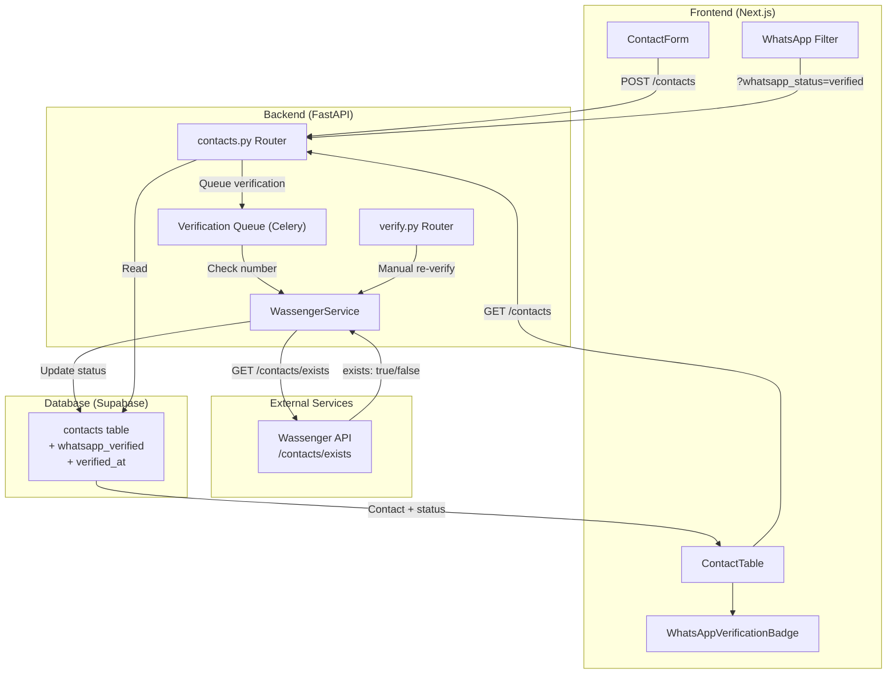

# Design Document - WhatsApp Verification

## Overview

Cette fonctionnalité ajoute la vérification automatique des numéros WhatsApp lors de l'ajout de contacts dans le système. Elle utilise l'API Wassenger pour vérifier si un numéro est enregistré sur WhatsApp et affiche un badge visuel (vert/rouge/gris) pour indiquer le statut de chaque contact.

L'objectif principal est d'éviter le gaspillage de ressources en permettant aux administrateurs d'identifier rapidement les numéros valides pour les campagnes WhatsApp.

## Architecture



## Components and Interfaces

### Backend Components

#### 1. WassengerService Extension

Ajouter une méthode `check_whatsapp_exists` au service existant :

```python
@dataclass
class WhatsAppExistsResponse:
    """Réponse de vérification d'existence WhatsApp"""
    exists: bool
    phone: str
    error_code: Optional[str] = None
    error_message: Optional[str] = None

async def check_whatsapp_exists(self, phone: str) -> WhatsAppExistsResponse:
    """
    Vérifie si un numéro est enregistré sur WhatsApp via Wassenger API.
    Endpoint: GET /v1/contacts/exists?phone={phone}&device={device_id}
    """
```

#### 2. Verification Router (`/api/verify`)

Nouveaux endpoints :
- `POST /api/verify/{contact_id}` - Vérifier/re-vérifier un contact
- `POST /api/verify/bulk` - Vérification en masse (avec queue)

#### 3. Celery Task pour vérification asynchrone

```python
@celery_app.task(bind=True, max_retries=3)
def verify_whatsapp_task(self, contact_id: int):
    """Tâche asynchrone de vérification WhatsApp"""
```

### Frontend Components

#### 1. WhatsAppVerificationBadge

Nouveau composant pour afficher le statut de vérification :

```typescript
interface WhatsAppVerificationBadgeProps {
  status: 'verified' | 'not_whatsapp' | 'pending' | null;
  onReVerify?: () => void;
  isLoading?: boolean;
  size?: 'sm' | 'md';
}
```

#### 2. ContactTable Extension

Ajouter une colonne pour le badge WhatsApp et un filtre par statut.

#### 3. useVerifyContact Hook

Hook React Query pour la vérification manuelle :

```typescript
function useVerifyContact() {
  return useMutation({
    mutationFn: (contactId: number) => api.post(`/verify/${contactId}`),
    onSuccess: () => queryClient.invalidateQueries(['contacts'])
  });
}
```

## Data Models

### Database Schema Changes

```sql
-- Migration: Add WhatsApp verification fields to contacts table
ALTER TABLE contacts 
ADD COLUMN whatsapp_verified BOOLEAN DEFAULT NULL,
ADD COLUMN verified_at TIMESTAMP DEFAULT NULL;

-- Index for filtering by verification status
CREATE INDEX idx_contacts_whatsapp_verified ON contacts(whatsapp_verified);
```

### Pydantic Schemas

```python
class ContactResponse(BaseModel):
    # ... existing fields ...
    whatsapp_verified: Optional[bool] = None
    verified_at: Optional[datetime] = None

class WhatsAppVerificationResult(BaseModel):
    contact_id: int
    whatsapp_verified: bool
    verified_at: datetime
    
class BulkVerificationRequest(BaseModel):
    contact_ids: List[int]
    
class BulkVerificationResponse(BaseModel):
    queued_count: int
    message: str
```

### TypeScript Types

```typescript
interface Contact {
  // ... existing fields ...
  whatsapp_verified: boolean | null;
  verified_at: string | null;
}

type WhatsAppStatus = 'verified' | 'not_whatsapp' | 'pending' | null;
```

## Correctness Properties

*A property is a characteristic or behavior that should hold true across all valid executions of a system-essentially, a formal statement about what the system should do. Properties serve as the bridge between human-readable specifications and machine-verifiable correctness guarantees.*

### Property 1: Contact creation independence from verification

*For any* contact creation request, the contact SHALL be successfully created in the database regardless of the WhatsApp verification outcome (success, failure, or timeout).

**Validates: Requirements 1.4**

### Property 2: Verification status persistence

*For any* WhatsApp verification result (true, false, or error), the contact's `whatsapp_verified` field SHALL be updated to match the API response (true, false, or null respectively), and `verified_at` SHALL be set to the current timestamp.

**Validates: Requirements 1.2, 3.2**

### Property 3: Error handling sets null status

*For any* verification request that fails due to network error, API error, or timeout, the contact's `whatsapp_verified` field SHALL be set to null.

**Validates: Requirements 1.3**

### Property 4: Badge rendering matches verification status

*For any* contact, the WhatsAppVerificationBadge component SHALL render:
- Green badge with WhatsApp icon when `whatsapp_verified === true`
- Red badge with warning icon when `whatsapp_verified === false`
- Gray badge with "non vérifié" text when `whatsapp_verified === null`

**Validates: Requirements 2.1, 2.2, 2.3**

### Property 5: WhatsApp filter returns correct subset

*For any* list of contacts and filter value "verified", the filtered result SHALL contain only contacts where `whatsapp_verified === true`. The count of filtered results SHALL equal the count of contacts with `whatsapp_verified === true` in the original list.

**Validates: Requirements 4.2**

### Property 6: Statistics calculation accuracy

*For any* set of contacts, the verification statistics SHALL satisfy:
- `verified_count` = count of contacts where `whatsapp_verified === true`
- `not_whatsapp_count` = count of contacts where `whatsapp_verified === false`
- `pending_count` = count of contacts where `whatsapp_verified === null`
- `verified_count + not_whatsapp_count + pending_count` = total contact count

**Validates: Requirements 5.1**

### Property 7: Category verification percentage

*For any* category with contacts, the WhatsApp verification percentage SHALL equal `(verified_count / total_contacts_in_category) * 100`, rounded to one decimal place.

**Validates: Requirements 5.2**

### Property 8: Rate limit retry behavior

*For any* rate limit error from the Wassenger API, the system SHALL schedule a retry after the specified delay (minimum 60 seconds) and SHALL NOT make another request before that delay expires.

**Validates: Requirements 6.1, 6.2**

## Error Handling

### API Errors

| Error Type | Action | User Message |
|------------|--------|--------------|
| Network timeout | Set status to null, log error | "Vérification en attente - réessayez plus tard" |
| Rate limit (429) | Queue retry with delay | "Vérification en file d'attente" |
| Invalid phone format | Set status to false | "Format de numéro invalide" |
| Device disconnected | Set status to null, alert admin | "Appareil WhatsApp déconnecté" |
| Unknown error | Set status to null, log error | "Erreur de vérification" |

### Graceful Degradation

- Si l'API Wassenger est indisponible, les contacts sont créés avec `whatsapp_verified = null`
- L'interface affiche un badge gris "non vérifié" sans bloquer l'utilisateur
- Une tâche de fond peut re-vérifier les contacts en attente

## Testing Strategy

### Property-Based Testing Framework

Utiliser **Hypothesis** (Python) pour les tests backend et **fast-check** (TypeScript) pour les tests frontend.

### Unit Tests

1. **WassengerService.check_whatsapp_exists**
   - Test avec numéro valide existant sur WhatsApp
   - Test avec numéro valide non-WhatsApp
   - Test avec numéro invalide
   - Test avec timeout réseau

2. **WhatsAppVerificationBadge Component**
   - Snapshot tests pour chaque état de badge
   - Test d'accessibilité (aria-labels)

3. **Contact Filter Logic**
   - Test de filtrage par statut
   - Test de combinaison de filtres

### Property-Based Tests

1. **Property 1**: Contact creation independence
   - Générer des contacts aléatoires et des résultats de vérification aléatoires
   - Vérifier que le contact est toujours créé

2. **Property 4**: Badge rendering
   - Générer des contacts avec différents statuts de vérification
   - Vérifier que le badge correspond au statut

3. **Property 5**: Filter correctness
   - Générer des listes de contacts avec statuts aléatoires
   - Vérifier que le filtre retourne le bon sous-ensemble

4. **Property 6**: Statistics accuracy
   - Générer des ensembles de contacts avec statuts aléatoires
   - Vérifier que les comptages sont corrects

### Integration Tests

1. Flux complet de création de contact avec vérification
2. Re-vérification manuelle d'un contact
3. Import CSV avec vérification en masse
